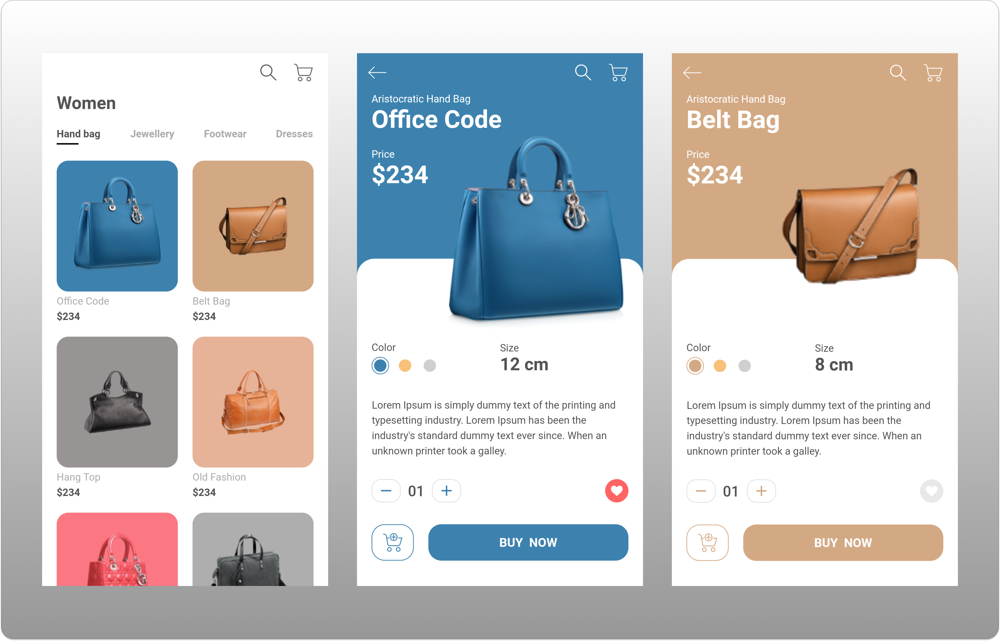

# Flutter - UI Shop

<h1 align="center">
  
</h1>

A small UI project that I used to implement an idea of online store.


## Author

#### Renata Oliveira
[](https://www.linkedin.com/in/renatafariaoliveira/)


## Requirements

This project was built using Flutter SDK [2.0.3] and Dart [2.12.2].

* Any Operating System (ie. MacOS X, Linux, Windows)
* Any IDE with Flutter SDK installed (ie. Android Studio, VSCode, IntelliJ, etc)
* A little knowledge of Dart and Flutter

_Tip: For help getting started with Flutter, view
[online documentation](https://flutter.dev/docs)._

## Get Started

Important: You need to set up your dev environment previously.

1. Clone this repository to your machine.
1. Open console and got to the root project.
2. Run this coomands in order:

 ```flutter pub get```

 ```flutter run```

## Libs & Packages

**_dependencies_**
* [flutter_svg](https://pub.dev/packages/flutter_svg): Draw SVG files on a Flutter Widget.
* [google_fonts](https://pub.dev/packages/google_fonts): Allows you to easily use any of the 977 fonts to your app.


## Screenshots

<h1 align="center">
  
  
  
</h1>

## [Mock] Product Model

```
ProductModel(
    id: 1,
    title: "Office Code",
    price: 234,
    size: 12,
    description: "Lorem Ipsum is simply dummy text of the printing and typesetting industry",
    image: "assets/images/bag_1.png",
    color: Color(0xFF3D82AE),
  )
```